# LanPlayer

A web-based audio player for your own music collection — a personal alternative to Apple Music/Spotify on top of your own files (FLAC/MP3/...), without copying, transcoding, or subscriptions. Listen from any device on your local network through a browser.

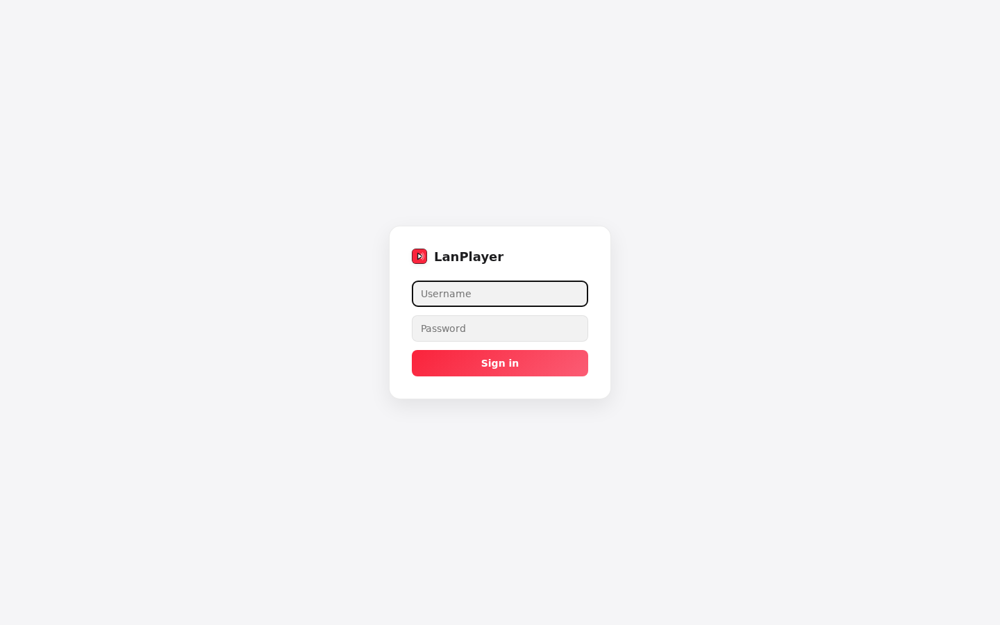

## Table of contents

- [Goals](#goals)
- [Features](#features)
  - [Library](#library)
  - [Playlists](#playlists)
  - [Radio and history](#radio-and-history)
  - [Player](#player)
  - [Mobile responsiveness](#mobile-responsiveness)
  - [Interface languages](#interface-languages)
  - [Administration](#administration)
- [Tech stack](#tech-stack)
- [Deploying on a clean Debian 13 machine](#deploying-on-a-clean-debian-13-machine)
  - [1. System packages](#1-system-packages)
  - [2. Get the code](#2-get-the-code)
  - [3. Backend](#3-backend)
  - [4. Frontend](#4-frontend)
  - [5. Run](#5-run)
  - [6. (optional) Autostart and restart resilience](#6-optional-autostart-and-restart-resilience)
  - [Verification](#verification)
- [Deploying with Docker Compose](#deploying-with-docker-compose)
  - [1. Prepare files](#1-prepare-files)
  - [2. Run](#2-run)
  - [3. Updating](#3-updating)

## Goals

- Listen to your own music through a browser, without transcoding and without copying files — the service reads them "as is" straight from disk/network share.
- Several isolated users on one server: each has their own library, playlists, likes, history, and equalizer profile — libraries of different users never overlap and are never visible to each other.
- Account management through a dedicated admin panel, with no need to SSH into the server after the initial setup.

## Features

### Library

A background scanner recursively walks the user's folder, indexes audio files (MP3, FLAC, OGG/Opus, M4A/AAC, WAV), and reads tags (ID3/Vorbis/MP4); if tags are missing or incomplete, it falls back to the file name and folder structure (Artist/Album/Track). Cover art is looked up in this order: embedded in the file → `cover.jpg`/`folder.jpg` etc. in the album folder → MusicBrainz + Cover Art Archive (best-effort, doesn't block the track from appearing in the library; the result is cached to disk, so already-processed albums won't be requested again). Sections for Songs, Albums, Artists, search, list/grid view toggle, sorting.

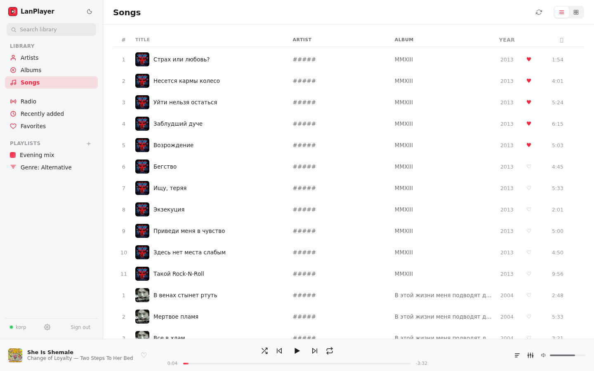
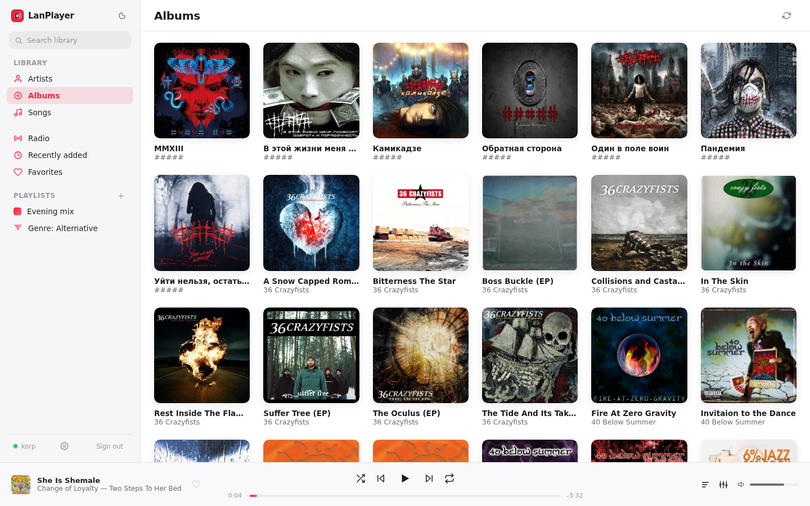
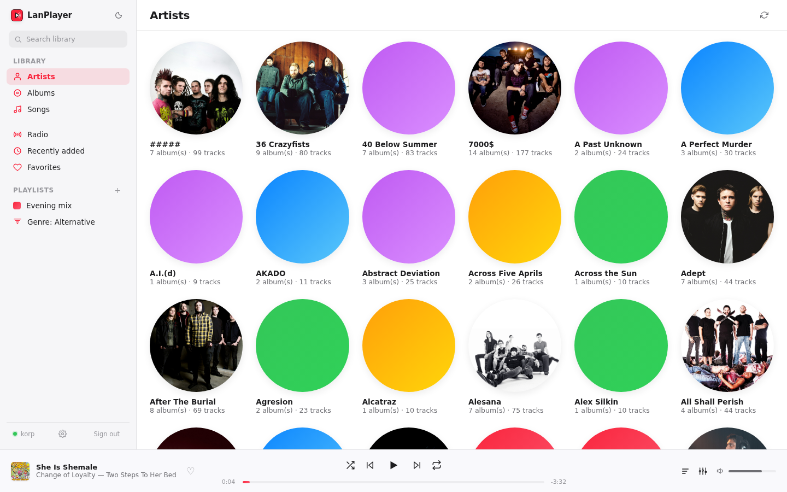

### Playlists

Regular playlists (manual track adding, reordering) and smart playlists — their contents are computed automatically by year, genre, decade, as well as "frequently played" / "rarely played" based on listening history. Import and export to M3U.

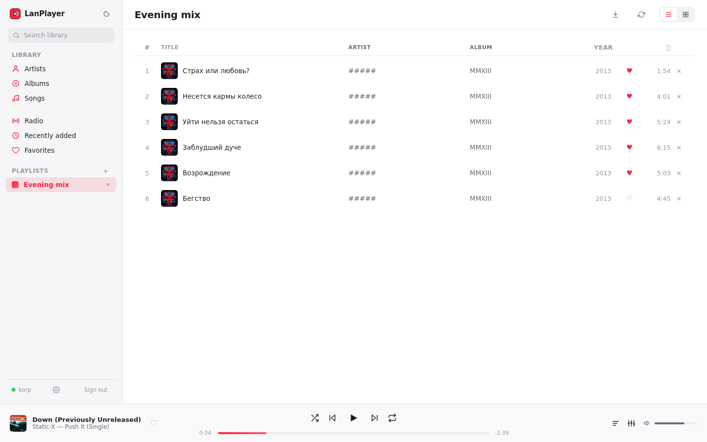
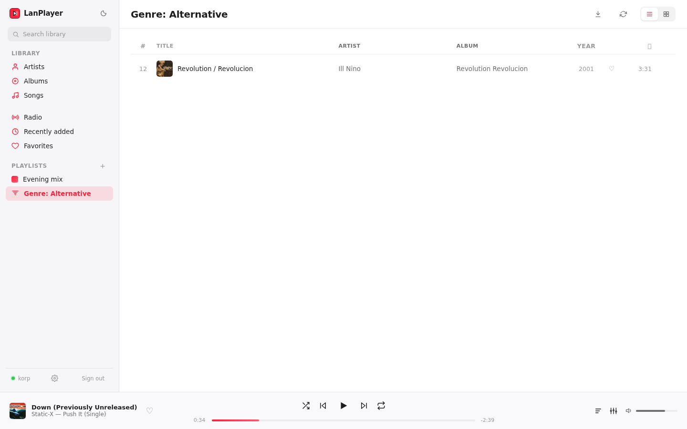

### Radio and history

"Radio" — a random selection of tracks from the whole library with automatic continuation.

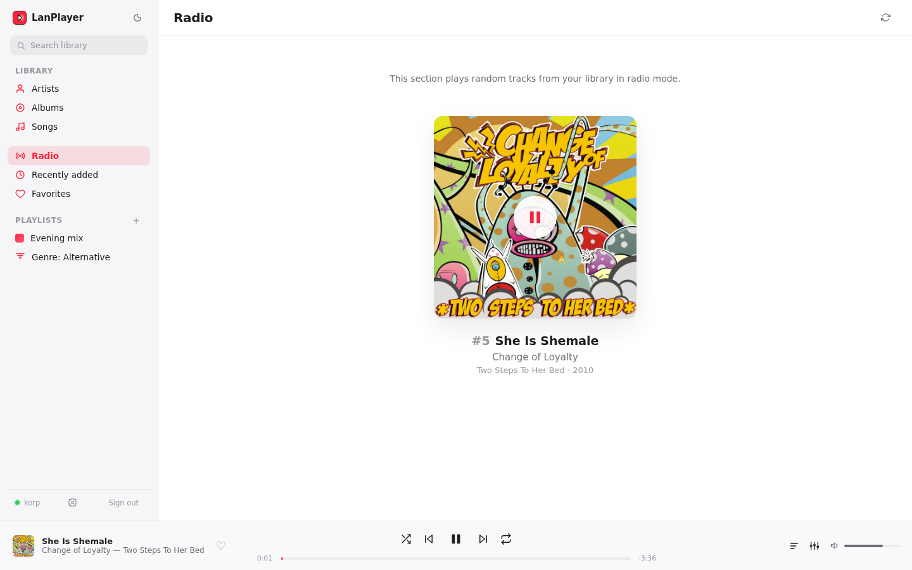

The "Favorites" section shows liked tracks:

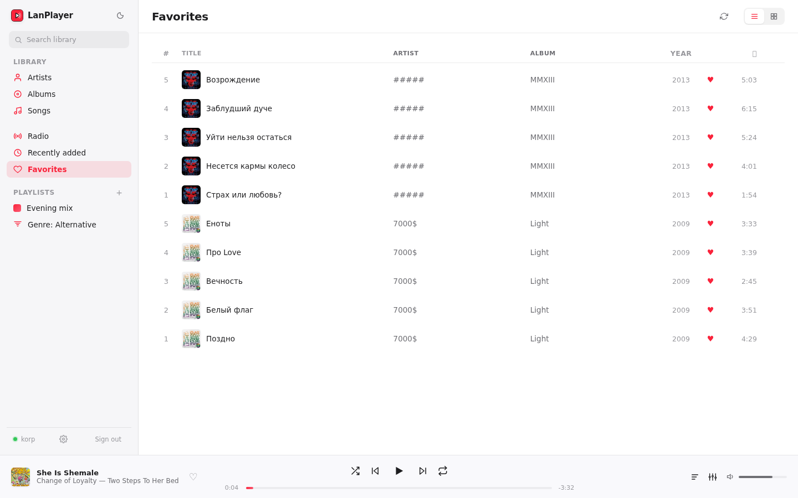

### Player

Playback queue, shuffle, repeat, likes. A ten-band graphic equalizer built on the Web Audio API: 14 built-in presets (bass, vocal, rock, jazz, acoustic, etc.) and the ability to save custom profiles tied to the account. Synced lyrics — first an `.lrc` file next to the track is looked for, and if there isn't one, lrclib.net is queried. The current track, playback position, queue, and equalizer settings are remembered on the server and restored on the next login.

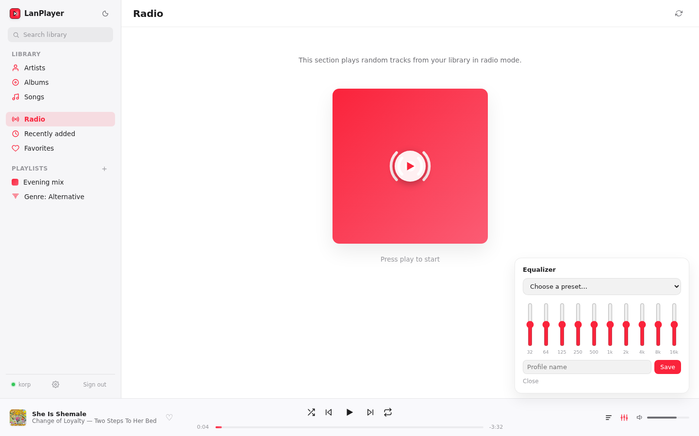
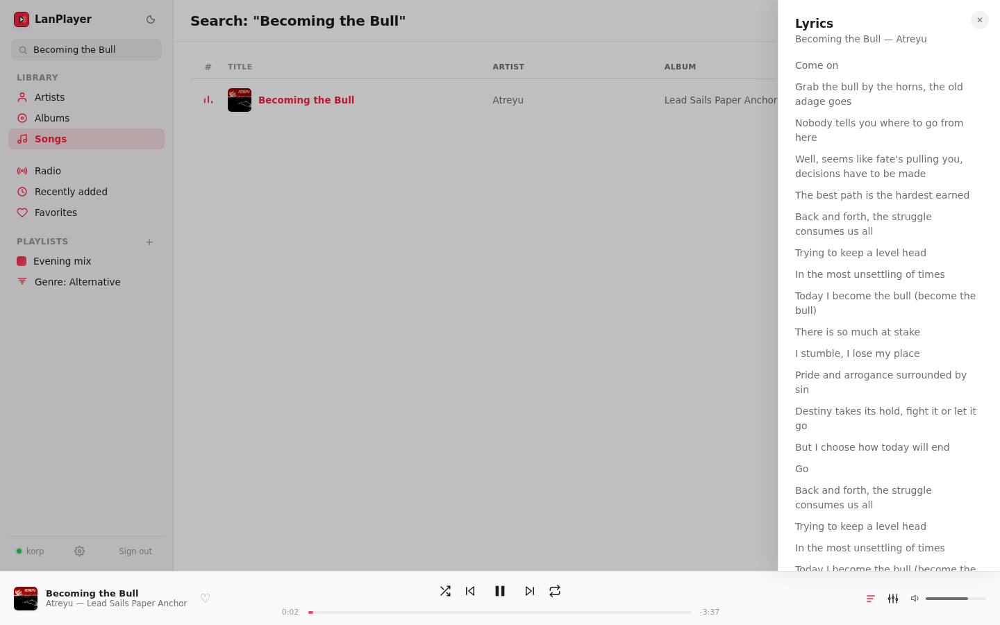

### Mobile responsiveness

Responsive layout for screens starting at 375px.

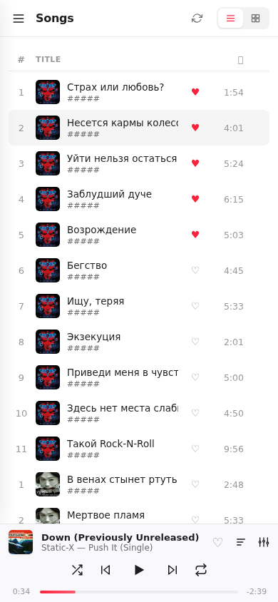

### Interface languages

Russian and English, switchable in user settings.

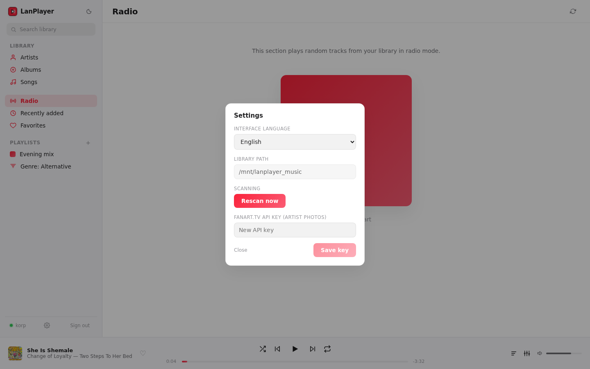

### Administration

A single service account, `admin`, is created automatically on the first launch of the application; its password is set via the `ADMIN_PASSWORD` environment variable. This account has no music library of its own and no regular player interface — after logging in, it only sees the user management page: creating an account (username, password, library path), changing password/path/active status, deletion, and manually triggering a library scan with real-time progress.

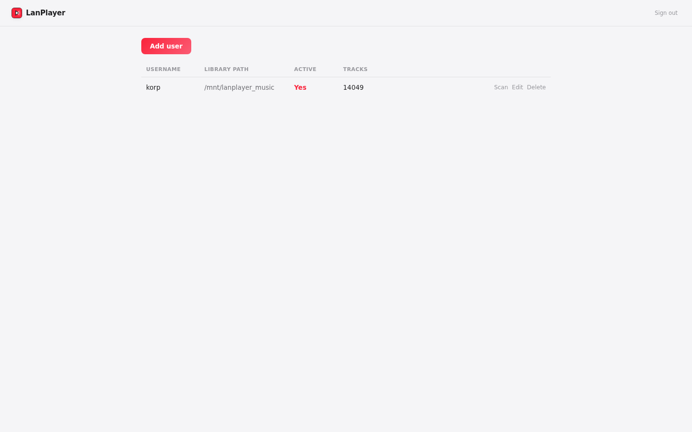

## Tech stack

**Backend**
- Python 3.13, [FastAPI](https://fastapi.tiangolo.com/) — REST API
- SQLAlchemy 2.0 + SQLite — data storage (no separate database server)
- `httpx` — requests to MusicBrainz / Cover Art Archive / fanart.tv / lrclib.net

**Frontend**
- React 19 + TypeScript, `react-router-dom`

## Deploying on a clean Debian 13 machine

### 1. System packages

```bash
sudo apt install -y python3 python3-venv python3-pip git nodejs npm
```

Debian 13 (trixie) ships Node.js 20.x in its standard repository — that's enough, a separate nvm isn't needed.

### 2. Get the code

```bash
git clone https://github.com/ElizarovEugene/LanPlayer.git lanplayer
cd lanplayer
```

### 3. Backend

```bash
cd backend
python3 -m venv .venv
source .venv/bin/activate
pip install -r requirements.txt
cd ..
```

The database (the `lanplayer.db` SQLite file) is created automatically on first launch — no separate migration step is needed.

Copy `.env.example` to `.env` and set at least `JWT_SECRET` (a random string, e.g. `openssl rand -hex 32`) and `ADMIN_PASSWORD` — the password for the `admin` service account, created automatically at startup.

### 4. Frontend

```bash
cd frontend
npm install
cd ..
```

### 5. Run

```bash
bash start.sh
```

The script starts the backend (`http://<host>:8002`) and the frontend dev server (`http://<host>:5175`), and stops both on Ctrl+C. Open `http://<host>:5175` in a browser.

> The frontend dev server listens on `0.0.0.0:5175` and proxies `/api` to the backend — to access it from other machines on the network, just open port 5175 in the firewall (`ufw allow 5175`).

### 6. (optional) Autostart and restart resilience

For continuous operation (not just within the current terminal session), it makes sense to set up systemd units instead of `start.sh`. Example for the backend (`/etc/systemd/system/lanplayer-backend.service`):

```ini
[Unit]
Description=LanPlayer backend
After=network.target

[Service]
User=<your-user>
WorkingDirectory=/path/to/lanplayer/backend
ExecStart=/path/to/lanplayer/backend/.venv/bin/python3 -m uvicorn app.main:app --host 0.0.0.0 --port 8002
Restart=on-failure

[Install]
WantedBy=multi-user.target
```

Similarly for the frontend (`ExecStart=/usr/bin/npm run dev`, `WorkingDirectory=.../frontend`), or — for a production setup — build the static assets (`npm run build` in `frontend/`) and serve the `frontend/dist` folder through nginx/Caddy instead of the dev server.

```bash
sudo systemctl daemon-reload
sudo systemctl enable --now lanplayer-backend lanplayer-frontend
```

### Verification

```bash
curl http://localhost:8002/health   # {"status":"ok"}
```

Open `http://<host>:5175` and sign in as **admin** with the password from `ADMIN_PASSWORD`. On the user management page, create a regular account, specifying a path to a music folder, and sign in as that user.

## Deploying with Docker Compose

Ready-made images are published on Docker Hub:
- [`elizaroveugene/lanplayer-backend`](https://hub.docker.com/r/elizaroveugene/lanplayer-backend)
- [`elizaroveugene/lanplayer-frontend`](https://hub.docker.com/r/elizaroveugene/lanplayer-frontend)

### 1. Prepare files

Create a working directory and config file:

```bash
mkdir lanplayer-docker && cd lanplayer-docker
```

Create `docker-compose.yml`:

```yaml
services:
  backend:
    image: elizaroveugene/lanplayer-backend:latest
    restart: unless-stopped
    env_file: .env
    volumes:
      - db_data:/data
      # Each user's library is mounted separately, read-only.
      # The path inside the container (after the ":") is what you
      # enter as the "library path" when creating a user in the
      # admin panel.
      - /mnt/music/korp:/data/library/korp:ro
    ports:
      - "8002:8002"

  frontend:
    image: elizaroveugene/lanplayer-frontend:latest
    restart: unless-stopped
    ports:
      - "5175:80"
    depends_on:
      - backend

volumes:
  db_data:
```

Create `.env` (see `.env.example` in the repository):

```env
# Generate a random string: openssl rand -hex 32
JWT_SECRET=replace-with-a-random-string

ADMIN_PASSWORD=a-strong-password
```

### 2. Run

```bash
docker compose up -d
```

The application will be available at: `http://<server-IP>:5175`. The backend is additionally published at `http://<server-IP>:8002` (health check, direct API access).

On first launch, the `admin` service account is created automatically with the password from `.env` (`ADMIN_PASSWORD`) — sign in as that account and create regular accounts on the user management page, specifying for each one a library path **inside the container** (e.g. `/data/library/korp` — matching the bind mount above). The database and cover art cache are stored in the `db_data` Docker volume and persist across restarts.

Each music folder needs to be mounted as a separate `volumes:` entry, `:ro` (read-only) — the container should not, and cannot, modify files on the share.

### 3. Updating

```bash
docker compose pull
docker compose up -d
```

Sign in as **admin** with the password from `.env`, same as during the initial setup.
